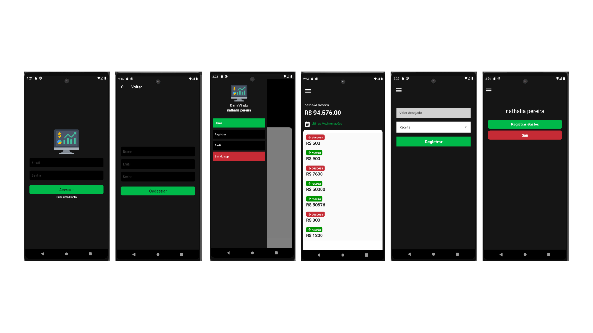

# Finanças 

### Tela Principal
esse aplicativo foi desenvolvido para estudo.


## 📖 Sobre o projeto
O projeto envolve a criação de um aplicativo de gerenciamento financeiro pessoal, utilizando React Native e Firebase.

### :computer: Tecnologias
- [JavaScript](https://www.javascript.com/)
- [React Native](https://reactnative.dev/)
- [Firebase](https://firebase.google.com/)

## :bricks: Instalação

1. Clone o repositório:
   ```bash
   git clone https://github.com/brunotorrespereira/financas.git
   ```

2. Navegue até o diretório do projeto:

```bash
cd financas
```

3. Instale as dependências usando npm ou yarn:

```bash
npm install
```

ou 

```bash
yarn install
```

4. Instale o ambiente de desenvolvimento para React Native conforme a documentação oficial.

## :arrow_forward: Execução
1. Inicie o servidor de desenvolvimento:

```bash
npx react-native start
```

2. Em outro terminal, execute o aplicativo no Android:

``` bash
npx react-native run-android
```

<p align="center">Desenvolvido por brunotorrespereira</p>


